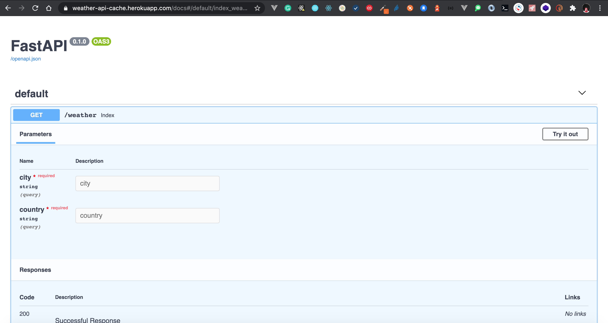

# Weatherapi

[](https://github.com/SamuelBonilla)

With Weatherapi you have access to current weather data, hourly, 5- and 16-day forecasts

### Public URL

[https://weather-api-cache.herokuapp.com/docs](https://weather-api-cache.herokuapp.com/docs)



### Requirements
  - Docker
  - Docker-compose
 
### technologies

| Stack | README |
| ------ | ------ |
| Redis | [https://redis.io](https://redis.io/) |
| Python | [https://www.python.org](https://www.python.org) |
| FastAPI | [https://fastapi.tiangolo.com](https://fastapi.tiangolo.com) |
| Pytest | [https://docs.pytest.org/en/6.2.x](https://docs.pytest.org/en/6.2.x/) |
| FastAPI_cache | [https://github.com/long2ice/fastapi-cache](https://github.com/long2ice/fastapi-cache) |

### Installation

Follow this [instructions](https://docs.docker.com/compose/install/)  to install Compose on Mac, Windows, Windows Server 2016, or Linux systems, or find out about alternatives like using the pip Python package manager or installing Compose as a container.

### Run
Weatherapi is very easy to install and deploy in a Docker container.

```sh
$ git clone https://github.com/SamuelBonilla/weatherapi.git
$ cd weatherapi
$ docker-compose up -d
$ docker-compose exec app bash
```

### Run REST API

```sh
$ bash run.sh
```


Verify the deployment by navigating to your server address in your preferred browser.

```sh
http://0.0.0.0:8000/weather?city=Bogota&country=co
```

### Testing API

```sh
$ pytest
```

### Heroku API ( Public URL )

```sh
https://weather-api-cache.herokuapp.com/weather?city=Bogota&country=co
```


License
----

MIT

